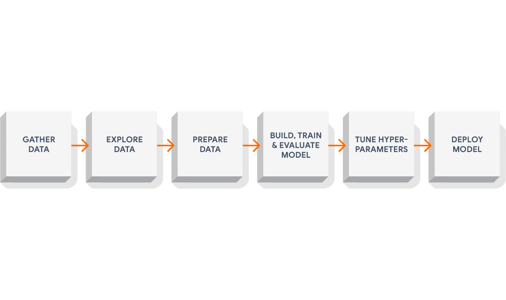
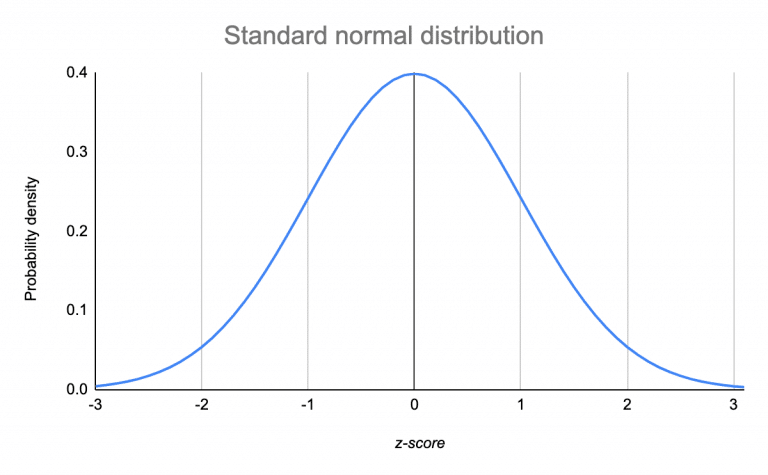
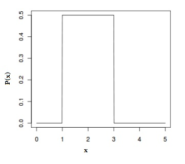
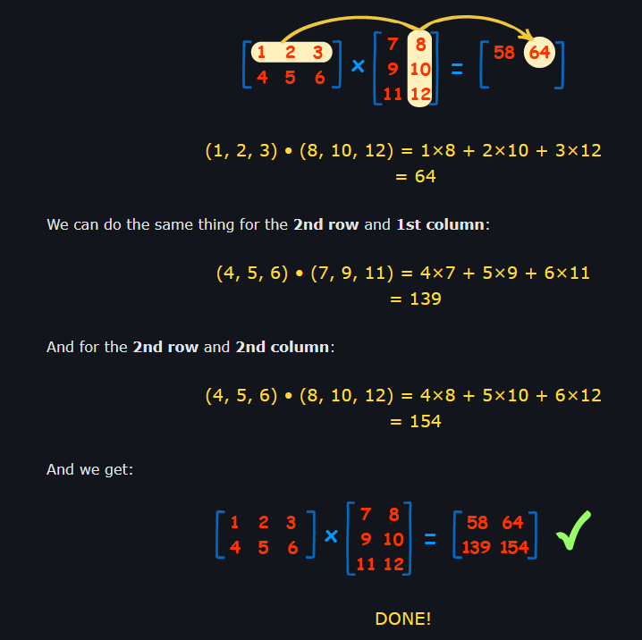
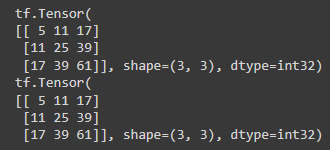
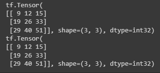

- [Anatomy of Neural Networks](#anatomy-of-neural-networks)
    - [Supervised Learning](#supervised-learning)
    - [Semi-supervised Learning](#semi-supervised-learning)
    - [Unsupervised Learning](#unsupervised-learning)
    - [Transfer Learning](#transfer-learning)
  - [Deep Learning Use Cases](#deep-learning-use-cases)
- [About TensorFlow](#about-tensorflow)
  - [What is TensorFlow?](#what-is-tensorflow)
  - [Why TensorFlow?](#why-tensorflow)
  - [What is a GPU/TPU?](#what-is-a-gputpu)
  - [What is a tensor?](#what-is-a-tensor)
  - [Dataflow](#dataflow)
- [Distributions](#distributions)
  - [Normal](#normal)
  - [Uniform](#uniform)
- [Getting information from tensors](#getting-information-from-tensors)
    - [Get various attributes of our tensor](#get-various-attributes-of-our-tensor)
- [Manipulating Tensors (operations)](#manipulating-tensors-operations)
  - [TensorFlow functions](#tensorflow-functions)
  - [Matrix Multiplication](#matrix-multiplication)
  - [Changing shape of tensors](#changing-shape-of-tensors)
  - [Changing the datatype of a tensor](#changing-the-datatype-of-a-tensor)
  - [Aggregating Tensors](#aggregating-tensors)
    - [Absolute Values](#absolute-values)
    - [Min](#min)
    - [Max](#max)
    - [Mean](#mean)
    - [Sum](#sum)
  - [Positional Min and Max](#positional-min-and-max)
  - [Sqeeze](#sqeeze)
  - [One-hot Encoding](#one-hot-encoding)
  - [Squaring, Square Root, and Logs](#squaring-square-root-and-logs)
  - [TensorFlow and NumPy](#tensorflow-and-numpy)
# Anatomy of Neural Networks

*Input Layer* - Data goes in here.
*Hidden Layer* - Arbitrary # of layers, "learns" patterns in data.
*Output Layer* - Outputs the learnedor prediction probabilities.

### Supervised Learning

Data & labels

### Semi-supervised Learning

Data & some labels

### Unsupervised Learning

Data only

### Transfer Learning

Results of previous model used on another set of data


## Deep Learning Use Cases

**Sequence to Sequence** (seq2seq)
e.g. translate from one language to another

**Classification/Regression**
e.g. Classify data and predict the price of a house

**Deep Mind**
e.g. Protein folding predictions

# About TensorFlow

[
    
](https://www.tensorflow.org/)

## What is TensorFlow?

- End-to-end machine learning framework
- Write fast deep learning code in Python/other accessible languages (able to run on a GPU/TPU)
- Access many pre-built deep learning models (TensorFlow Hub)
- Whole stack: preprocess data, model data, deploy model, evaluate model, etc.
- Originally designed and used in-house by Google (now open-source)

## Why TensorFlow?


## What is a GPU/TPU?

GPU: Graphics Processing Unit
TPU: Tensor Processing Unit (AI accelerator ASIC)
ASIC: Application specific integrated circuit

## What is a tensor?

A mathematical object analogous to but more general than a vector, represented by an array of components that are functions of the coordinates of a space.

## Dataflow


**Explanation YT Video:**
[](https://www.youtube.com/watch?v=f5liqUk0ZTw)


# Distributions

## Normal 
(bell-shaped)




## Uniform


# Getting information from tensors

* **Shape**: Length (number of elements) of each of the dimensions of a tensor.
  * `tensor.shape`
* **Rank**: Number of dimensions of a tensor. 
  * Scaler = rank 0
  * Vector = rank 1
  * Matrix = rank 2 
  * Tensor = rank n
  * `tensor.ndim`
* **Axis or Dimension**: A particular dimension of a tensor.
  * `tensor[0], tensor[:, 1]...`
* **Size**: The total number of items in the tensor.
  * `tf.size(tensor)` 

### Get various attributes of our tensor

`print("Datatype of every element:", rank_4_tensor.dtype)`
`print("Number of dimensions (rank):", rank_4_tensor.ndim)`
`print("Shape of tensor:", rank_4_tensor.shape)`
`print("Elements along the 0 axis:", rank_4_tensor.shape[0])`
`print("Elements along the last axis:", rank_4_tensor.shape[-1])`
`print("Total number of elements in our tensor:", tf.size(rank_4_tensor).numpy())`

**Create a rank 4 tensor (4 dimensions)**
`rank_4_tensor = tf.zeros(shape=[2, 3, 4, 5])`

**Get the first 2 elements of each dimension**
`rank_4_tensor[:2, :2, :2, :2]`

**Get the first dimension from each index except for the final one**
`rank_4_tensor[:1,:1, :1]` or `rank_4_tensor[:1,:1, :1, :]`

**Add in extra dimension to our rank 2 tensor**
`rank_5_tensor = rank_4_tensor[..., tf.newaxis]`

**Alternative to tf.newaxis**
`tf.expand_dims(rank_2_tensor, axis=-1)` 
"-1" means expand the final axis

# Manipulating Tensors (operations)

***Basic operations***
`+`, `-`, `*`, `/`

**e.g.**
`tensor = tf.constant([[1, 2], [3, 4]])`
`tensor + 10`
result: 
`<tf.Tensor: shape=(2, 2), dtype=int32, numpy=
array([[11, 12],
       [13, 14]], dtype=int32)>`

## TensorFlow functions
Applies the operation on every element in a tensor.

*\* Note*: TensorFlow operations are optimized to run faster than simply using `+`, `-`,`*`, `/`.
`tf.add(tensor, 10)`
`tf.subtract(tensor, 10)`
`tf.multiply(tensor, 10)`
`tf.divide(tensor, 10)`

## Matrix Multiplication

In machine learning, matrix multiplication is one of the most common tensor operations.

There are 2 rules our tensors (or matrices) need to fulfil if we're going to matrix multiply them:

1. The inner dimensions must match
2. The resulting matrix has the shape of the outer dimensions

[Visualization Website](http://www.matrixmultiplication.xyz)

`X = tf.constant([[1, 2, 3], [4, 5, 6]])`
`Y = tf.constant([[1, 2], [3, 4], [5, 6]])`

**Matrix multiplication in TensorFlow**
`tf.matmul(X, Y)`

**Matrix multiplication in Python**
`X @ Y`

**Explanation**:
[](https://www.mathsisfun.com/algebra/matrix-multiplying.html)

## Changing shape of tensors
`tf.reshape(Y, shape=[3, 2])`

Can do the same with transpose except transpose flips the axises
`X, tf.transpose(X), tf.reshape(X, shape=(2, 3))`

Results in different `dot product` because the axises have also been flipped along with the shape

**Transposed**:
`transposed = tf.transpose(B)`
`print(tf.matmul(A, transposed))`
`print(tf.tensordot(A, transposed, axes=1))`


**Reshaped**:
`reshaped = tf.reshape(B, shape=(2, 3))`
`print(tf.matmul(A, reshaped))`
`print(tf.tensordot(A, reshaped, axes=1))`


Generally, when performing matrix multiplication on two tensors and one of the axes doesn't line up, you will transpose (rather than reshape) one of the tensors to satisfy the matrix multiplication rules.

## Changing the datatype of a tensor

16bit dtypes can be used to save memory and run faster with modern hardware accelerators.

## Aggregating Tensors

`F = tf.constant(np.random.randint(-50, 50, 50))`

### Absolute Values

`tf.abs()`
`Absolutes = tf.abs(F).numpy()`

### Min

`tf.reduce_min()`
`Min = tf.reduce_min(F).numpy()`

### Max

`tf.reduce_max()`
`Max = tf.reduce_max(F).numpy()`

### Mean

`tf.reduce_mean()`
`Mean = tf.reduce_mean(F).numpy()`

### Sum

`tf.reduce_sum()`
`Sum = tf.reduce_sum(F).numpy()`

**Results**
`print("Absolute Values: %s\nMin: %s\nMax: %s\nMean: %s\nSum: %s"%(Absolutes, Min, Max, Mean, Sum))`

🔧 **Exercise:** 
With what we've just learned, find the variance and standard deviation of our `F` tensor using TensorFlow methods.

**Variance**
```
cast = tf.cast(F, dtype=tf.float32)
Variance = tf.math.reduce_variance(cast).numpy()
print("Variance: %s"%Variance)

# Alternatively, use tfp.stats.variance for rounded int

import tensorflow_probability as tfp

VarianceTfp = tfp.stats.variance(F).numpy()
print("TFP Variance: %s"%VarianceTfp)

```
**Standard Deviation**
```
cast = tf.cast(F, dtype=tf.float32)
Std = tf.math.reduce_std(cast).numpy()
print("Standard Deviation: %s"%Std)
```

## Positional Min and Max

``` 
tf.random.set_seed(42)
F = tf.random.uniform(shape=[50])
```
**Min**
```
index = tf.argmin(F)
argmin_tensor = F[index]
print(argmin_tensor)
```
Getting the minimum tensor using reduce_min
`tf.reduce_min(F)`

**Max**
```
index = tf.argmax(F)
argmax_tensor = F[index]
print(argmax_tensor)
```
Getting the maximum tensor using reduce_max
`tf.reduce_max(F)`

## Sqeeze

Removes dimensions of size 1 from the shape of a tensor.
```
tf.random.set_seed(42)
G = tf.constant(tf.random.uniform(shape=[50]), shape=(1, 1, 1, 1, 50))
G_squeezed = tf.squeeze(G)
print(G.shape, G_squeezed.shape)
```
**Result:**
(1, 1, 1, 1, 50) (50,)

## One-hot Encoding

**Create a list of indicies**
```
some_list = [0, 1, 2, 3] # could be red, green, blue, purple
```

**One hot encode our list of indicies**
`tf.one_hot(some_list, depth=4)`

## Squaring, Square Root, and Logs

`H = tf.range(1, 10)`
`tf.square(H)`

sqrt and log require non-int types

`float32Range = tf.cast(H, dtype=tf.float32)`
`tf.sqrt(float32Range)`
`tf.log(float32Range)`

## TensorFlow and NumPy

***Note***: One of the main differences between a TensorFlow tensor and a NumPy array is that a TensorFlow tensor can be run on a GPU or TPU (for faster numerical processing).

```
J = tf.constant(np.array([3., 7., 10.]))

# Convert the tensor back to a NumPy array
np.array(J), type(np.array(J))

# Convert tensor J to a NumPy array
J.numpy(), type(J.numpy())

# The default types of each are slightly different
numpy_J = tf.constant(np.array([3., 7., 10.]))
tensor_J = tf.constant([3., 7., 10.])

# Check the datatypes of each
numpy_J.dtype, tensor_J.dtype

# Results: (tf.float64, tf.float32)
```