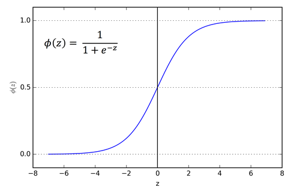

# 02 - Classification

- [02 - Classification](#02---classification)
- [Types](#types)
  - [Binary Classification](#binary-classification)
  - [Multiclass Classification](#multiclass-classification)
  - [Multilabel Classification](#multilabel-classification)
- [Classification inputs & outputs](#classification-inputs--outputs)
- [Activation Functions](#activation-functions)
  - [Linear](#linear)
  - [Rectified Linear Unit (ReLU)](#rectified-linear-unit-relu)
  - [Sigmoid (logistic)](#sigmoid-logistic)
  - [Tanh](#tanh)
  - [Softmax](#softmax)

# Types

What is a classification problem?

## Binary Classification

The task of classifying the elements of a set into two groups (each called class) on the basis of a classification rule.

_e.g._ is this email spam or not spam?

## Multiclass Classification

The problem of classifying instances into one of three or more classes. aka multinomial classification.

_e.g._ is this a photo of sushi, steak, or pizza?

## Multilabel Classification

The problem of finding a model that maps inputs x to binary vectors y; that is, it assigns a value of 0 or 1 for each element (label) in y.

_e.g._ What tags does this web article need?

# Classification inputs & outputs

**Images:**

- W: width
- H: height
- C: color channels

**Tensor shape:** [batch_size, width, height, color_channels]
batch_size = number of images in the batch

| Hyperparameter           | Binary Classification                                                                                         | Multiclass Classification                                             |
| :----------------------- | :------------------------------------------------------------------------------------------------------------ | :-------------------------------------------------------------------- |
| Input Layer Shape        | Same as number of features (e.g. 5 for age, sex, height, weight, smoking status in heart dissease prediction) | Same as binary classification                                         |
| Hidden Layer(s)          | Problem specific, minimum = 1, maximum = unlimited                                                            | Same as binary classification                                         |
| Neurons per Hidden Layer | Problem specific, generally 10 to 100                                                                         | Same as binary classification                                         |
| Output Layer Shape       | 1 (one class or the other)                                                                                    | 1 per class (e.g. 3 for food, person or dog photo)                    |
| Hidden Activation        | Usually ReLU (rectified linear unit)                                                                          | Same as binary classification                                         |
| Output Activation        | Sigmoid                                                                                                       | Softmax                                                               |
| Loss Function            | Cross entropy (tf.keras.losses.BinaryCrossentropy in TensorFlow)                                              | Cross entropy (tf.keras.losses.CategoricalCrossentropy in TensorFlow) |
| Optimizer                | SGD (stochastic gradient descent), Adam                                                                       | Same as binary classification                                         |

# Activation Functions

## Linear

A straight line function where activation is proportional to input ( which is the weighted sum from neuron ).

## Rectified Linear Unit (ReLU)

A recent invention which stands for Rectified Linear Units. The formula is deceptively simple: max(0,z). Despite its name and appearance, it’s not linear and provides the same benefits as Sigmoid (i.e. the ability to learn nonlinear functions), but with better performance.

## Sigmoid (logistic)

Sigmoid takes a real value as input and outputs another value between 0 and 1. It’s easy to work with and has all the nice properties of activation functions: it’s non-linear, continuously differentiable, monotonic, and has a fixed output range.

## Tanh

Tanh squashes a real-valued number to the range [-1, 1]. It’s non-linear. But unlike Sigmoid, its output is zero-centered. Therefore, in practice the tanh non-linearity is always preferred to the sigmoid nonlinearity.

## Softmax

Softmax function calculates the probabilities distribution of the event over ‘n’ different events. In general way of saying, this function will calculate the probabilities of each target class over all possible target classes. Later the calculated probabilities will be helpful for determining the target class for the given inputs.

Source: [ML Cheatsheat - Activation Functions](https://ml-cheatsheet.readthedocs.io/en/latest/activation_functions.html)
